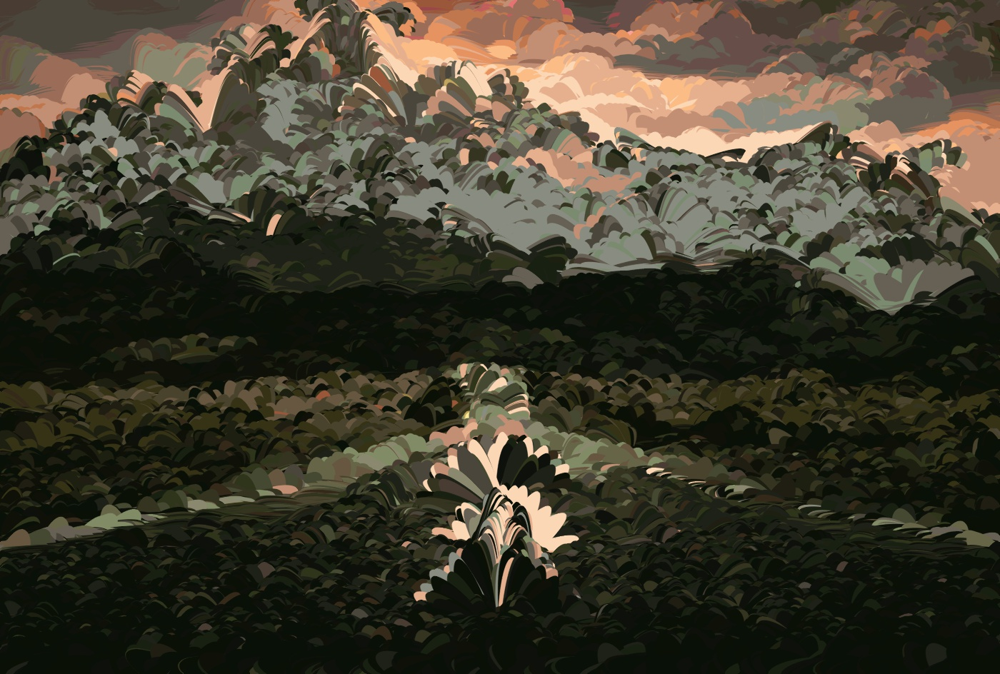

# Pointillism
This repo contains a python application that converts a photo to a pointillist painting.

You can find informations about the algorithm [here](https://medium.com/@matteoronchetti/https-medium-com-matteoronchetti-pointillism-with-python-and-opencv-f4274e6bbb7b)

## Installation
```
cd Pointillism
pip3 install -r requirements.txt
python3 -m pip install Pillow
python3 gui.py
```
